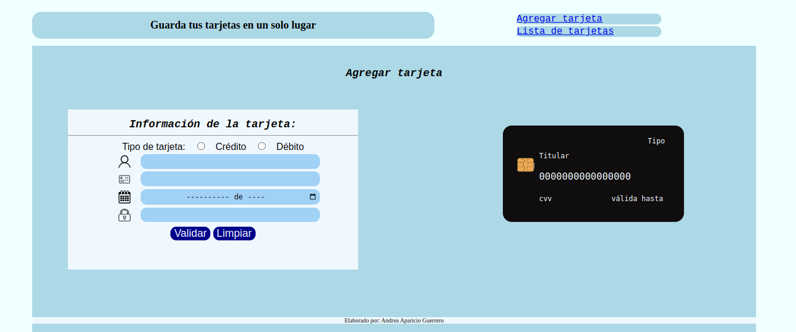
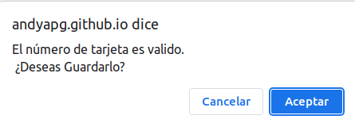
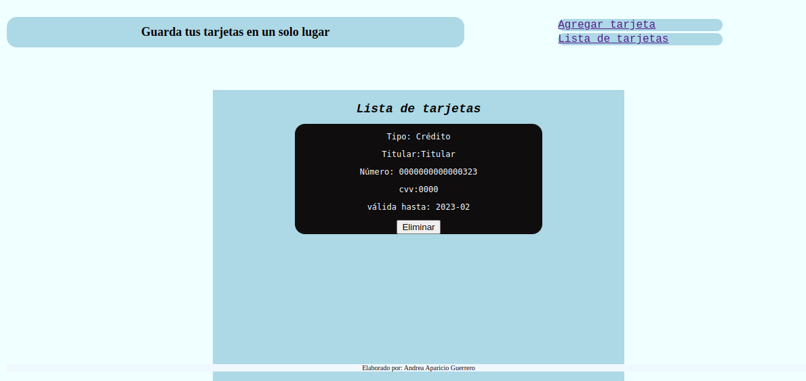
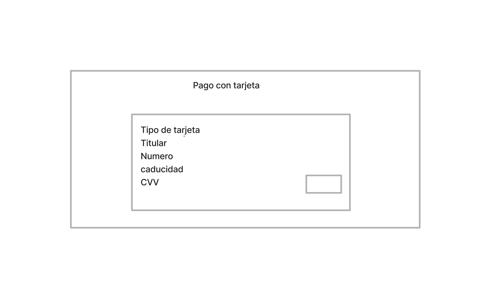
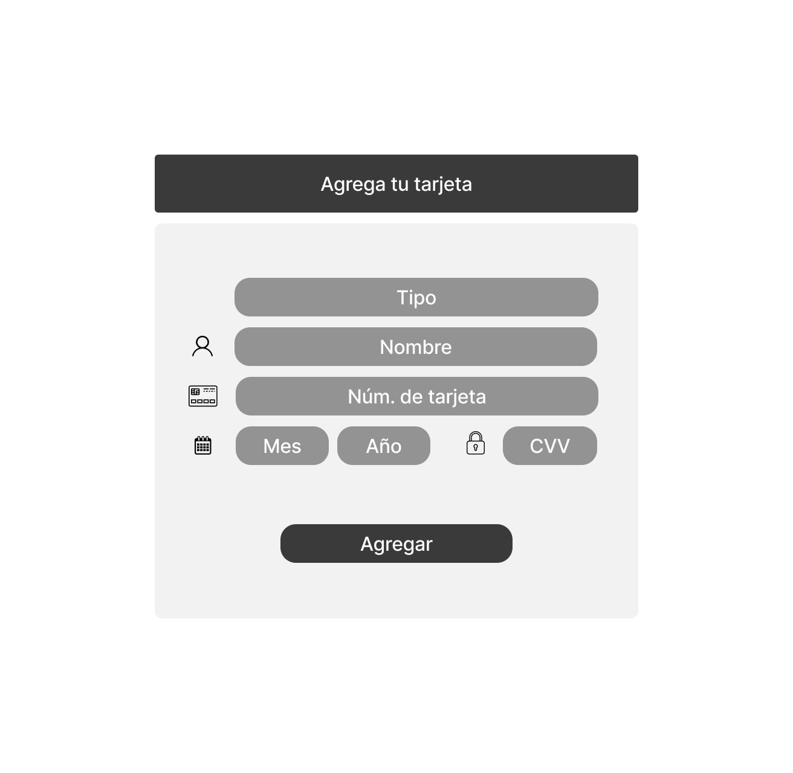

# Billetera electrónica
## 1. Contexto
En nuestra vida cotidiana, el pago con tarjetas de cŕedito o débito es muy común en compras en tiendas en linea o pagos de servicios. Por lo que es muy útil tener guardadas las tarjetas que usamos frecuentemente.

Esta aplicacón web es para que el usuario pueda guardar los datos de  sus tarjetas de crédito o débito. Los principales usuarios son personas que deseen tener la información de sus tarjetas en un solo lugar para realizar una compra en linea cuando lo necesiten sin necesidad de cargar las tarjetas físicas.

## 2. Funciones de la aplicación

Bajo el supuesto que el usuario inició sesión en el sitio, la pantalla principal sería la siguiente:

En donde en el encabezado se encuentra alineado a la izquierda y contiene el texto **Guarda tus tarjetas en un solo lugar**. La barra de navegación permite ir a la **Lista de tarjetas**, como su posición es fija, el usuario no la perderá de vista y podrá regresar a esta vista seleccionando **Agregar tarjeta**. 

En la parte central derecha de la pantalla muestran los campos en que el usuario debe ingresar la **información de la tarjeta**. Estos son:
1. **Tipo de tarjeta.** Credito o debito
2. **Titular.** Nombre del titular de la tarjeta
3. **Número de tarjeta.** Número de 16 digitos
4. **Valida hasta.** Fecha de vencimiento de la tarjeta
5. **Código cvv.** Número de tres cifras que se encuentra al reverso de la tarjeta.

Al comenzar a ingresar o seleccionar los datos, el usuario podrá ver en la parte central derecha de la pantalla, como se van escribiendo  sobre la tarjeta negra. Al terminar, el usuario deberá comprobar que el número de tarjeta es válido pulsando el botón **Validar**,si se presiona el boton validar sin agragar el numero de la tarjeta, aparecerá el mensaje **"No hay datos que guardar"**, en caso de que el número de tarjeta no sea valido,se mostrará el mensaje **"Número de tarjeta invalido"** y de ser válido entonces aparecerá el mensaje de confirmación que aparece en la imagen siguiente:

Al hacer clik en **aceptar**, la información se guarda en una lista de tarjetas, como se muestra en la siguiente imagen. Finalmente con el boton **Limpiar** se quitan los datos del formulario y de la tarjeta.

Donde el usuario puede ver la información que ingresó, regresar a agregar otra tarjeta o eliminar la que prefiera.

## Prototipo de baja y de alta fidelidad

Por último, agrego los prototipos de baja y alta fidelidad respectivamente.

